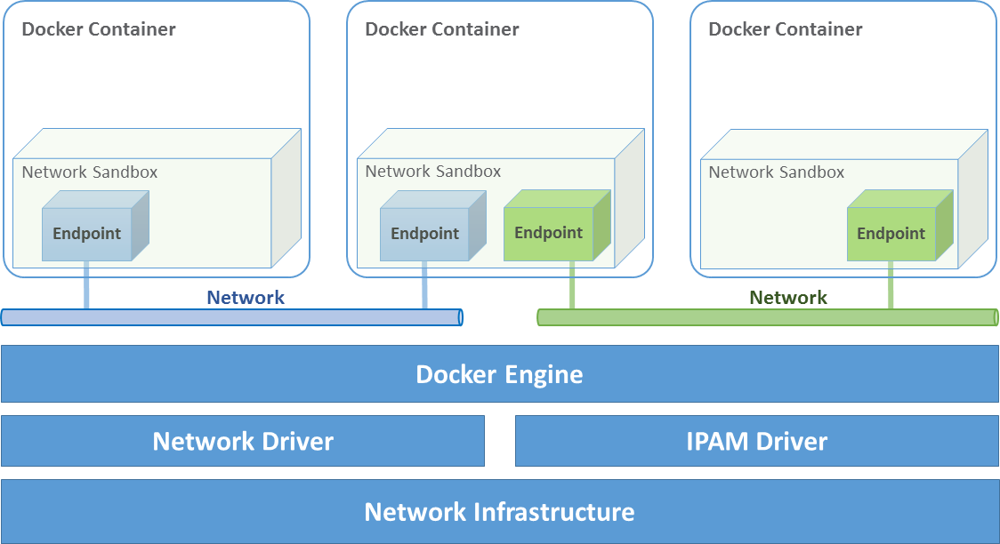
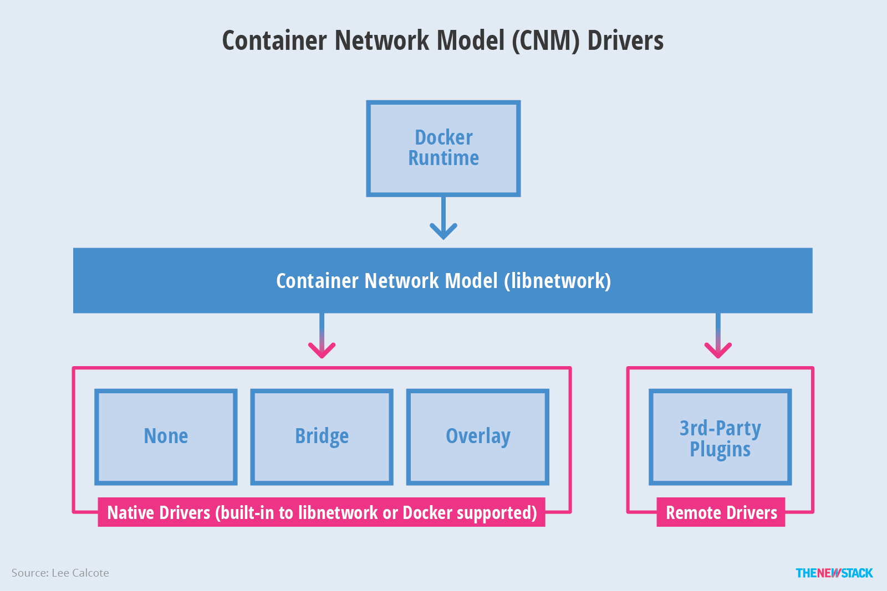

# Networking > Understand ​​the ​​Container​​ Network​ ​Model​ ​and ​​how​ ​it ​​interfaces​ ​with ​​the ​​Docker ​​engine and​​ network​​ and ​​IPAM ​​drivers

[Back](./ReadMe.md)

Challenges of Networking Containers and Microservices
-----------------------------------------------------

Microservices practices have increased the scale of applications which has put even more importance on the methods of connectivity and isolation provided to applications. The Docker networking philosophy is application driven. It aims to provide options and flexibility to the network operators as well as the right level of abstraction to the application developers.

Like any design, network design is a balancing act. Docker Enterpirse and the Docker ecosystem provide multiple tools to network engineers to achieve the best balance for their applications and environments. Each option provides different benefits and tradeoffs. The remainder of this guide details each of these choices so network engineers can understand what might be best for their environments.

Docker has developed a new way of delivering applications, and with that, containers have also changed some aspects of how networking is approached. The following topics are common design themes for containerized applications:

-   Portability

    -   *How do I guarantee maximum portability across diverse network environments while taking advantage of unique network characteristics?*
-   Service Discovery

    -   *How do I know where services are living as they are scaled up and down?*
-   Load Balancing

    -   *How do I spread load across services as services themselves are brought up and scaled?*
-   Security

    -   *How do I segment to prevent the wrong containers from accessing each other?*
    -   *How do I guarantee that a container with application and cluster control traffic is secure?*
-   Performance

    -   *How do I provide advanced network services while minimizing latency and maximizing bandwidth?*
-   Scalability

    -   *How do I ensure that none of these characteristics are sacrificed when scaling applications across many hosts?*

The Container Networking Model
------------------------------

The Docker networking architecture is built on a set of interfaces called the *Container Networking Model* (CNM). The philosophy of CNM is to provide application portability across diverse infrastructures. This model strikes a balance to achieve application portability and also takes advantage of special features and capabilities of the infrastructure.



### CNM Constructs

There are several high-level constructs in the CNM. They are all OS and infrastructure agnostic so that applications can have a uniform experience no matter the infrastructure stack.

-   Sandbox --- A Sandbox contains the configuration of a container's network stack. This includes the management of the container's interfaces, routing table, and DNS settings. An implementation of a Sandbox could be a Windows HNS or Linux Network Namespace, a FreeBSD Jail, or other similar concept. A Sandbox may contain many endpoints from multiple networks.
-   Endpoint --- An Endpoint joins a Sandbox to a Network. The Endpoint construct exists so the actual connection to the network can be abstracted away from the application. This helps maintain portability so that a service can use different types of network drivers without being concerned with how it's connected to that network.
-   Network --- The CNM does not specify a Network in terms of the OSI model. An implementation of a Network could be a Linux bridge, a VLAN, etc. A Network is a collection of endpoints that have connectivity between them. Endpoints that are not connected to a network do not have connectivity on a network.

### CNM Driver Interfaces

The Container Networking Model provides two pluggable and open interfaces that can be used by users, the community, and vendors to leverage additional functionality, visibility, or control in the network.

The following network drivers exist:

-   Network Drivers --- Docker Network Drivers provide the actual implementation that makes networks work. They are pluggable so that different drivers can be used and interchanged easily to support different use cases. Multiple network drivers can be used on a given Docker Engine or Cluster concurrently, but each Docker network is only instantiated through a single network driver. There are two broad types of CNM network drivers:
    -   Native Network Drivers --- Native Network Drivers are a native part of the Docker Engine and are provided by Docker. There are multiple drivers to choose from that support different capabilities like overlay networks or local bridges.
    -   Remote Network Drivers --- Remote Network Drivers are network drivers created by the community and other vendors. These drivers can be used to provide integration with incumbent software and hardware. Users can also create their own drivers in cases where they desire specific functionality that is not supported by an existing network driver.
-   IPAM Drivers --- Docker has a native IP Address Management Driver that provides default subnets or IP addresses for the networks and endpoints if they are not specified. IP addressing can also be manually assigned through network, container, and service create commands. Remote IPAM drivers also exist and provide integration to existing IPAM tools.



### Docker Native Network Drivers

The Docker native network drivers are part of Docker Engine and don't require any extra modules. They are invoked and used through standard `docker network` commands. The following native network drivers exist.

| Driver | Description |
| --- | --- |
| Host | With the `host` driver, a container uses the networking stack of the host. There is no namespace separation, and all interfaces on the host can be used directly by the container. |
| Bridge | The `bridge` driver creates a Linux bridge on the host that is managed by Docker. By default containers on a bridge can communicate with each other. External access to containers can also be configured through the `bridge` driver. |
| Overlay | The `overlay` driver creates an overlay network that supports multi-host networks out of the box. It uses a combination of local Linux bridges and VXLAN to overlay container-to-container communications over physical network infrastructure. |
| MACVLAN | The `macvlan` driver uses the Linux MACVLAN bridge mode to establish a connection between container interfaces and a parent host interface (or sub-interfaces). It can be used to provide IP addresses to containers that are routable on the physical network. Additionally VLANs can be trunked to the `macvlan` driver to enforce Layer 2 container segmentation. |
| None | The `none` driver gives a container its own networking stack and network namespace but does not configure interfaces inside the container. Without additional configuration, the container is completely isolated from the host networking stack. |

### Network Scope

As seen in the `docker network ls` output, Docker network drivers have a concept of *scope*. The network scope is the domain of the driver which can be the `local` or `swarm` scope. Local scope drivers provide connectivity and network services (such as DNS or IPAM) within the scope of the host. Swarm scope drivers provide connectivity and network services across a swarm cluster. Swarm scope networks have the same network ID across the entire cluster while local scope networks have a unique network ID on each host.

```
$ docker network ls
NETWORK ID          NAME                DRIVER              SCOPE
1475f03fbecb        bridge              bridge              local
e2d8a4bd86cb        docker_gwbridge     bridge              local
407c477060e7        host                host                local
f4zr3zrswlyg        ingress             overlay             swarm
c97909a4b198        none                null                local

```

### Docker Remote Network Drivers

The following community- and vendor-created remote network drivers are compatible with CNM. Each provides unique capabilities and network services for containers.

| Driver | Description |
| --- | --- |
| [contiv](http://contiv.github.io/) | An open source network plugin led by Cisco Systems to provide infrastructure and security policies for multi-tenant microservices deployments. Contiv also provides integration for non-container workloads and with physical networks, such as ACI. Contiv implements remote network and IPAM drivers. |
| [weave](https://www.weave.works/docs/net/latest/introducing-weave/) | A network plugin that creates a virtual network that connects Docker containers across multiple hosts or clouds. Weave provides automatic discovery of applications, can operate on partially connected networks, does not require an external cluster store, and is operations friendly. |
| [kuryr](https://github.com/openstack/kuryr) | A network plugin developed as part of the OpenStack Kuryr project. It implements the Docker networking (libnetwork) remote driver API by utilizing Neutron, the OpenStack networking service. Kuryr includes an IPAM driver as well. |

### Docker Remote IPAM Drivers

Community and vendor created IPAM drivers can also be used to provide integrations with existing systems or special capabilities.

| Driver | Description |
| --- | --- |
| [infoblox](https://hub.docker.com/r/infoblox/ipam-driver/) | An open source IPAM plugin that provides integration with existing Infoblox tools. |

> There are many Docker plugins that exist and more are being created all the time. Docker maintains a list of the [most common plugins](https://docs.docker.com/engine/extend/legacy_plugins/).

Linux Network Fundamentals
--------------------------

The Linux kernel features an extremely mature and performant implementation of the TCP/IP stack (in addition to other native kernel features like VXLAN and packet filtering). Docker networking uses the kernel's networking stack as low level primitives to create higher level network drivers. Simply put, *Docker networking is Linux networking.*

This implementation of existing Linux kernel features ensures high performance and robustness. Most importantly, it provides portability across many distributions and versions, which enhances application portability.

There are several Linux networking building blocks which Docker uses to implement its native CNM network drivers. This list includes Linux bridges, network namespaces, veth pairs, and iptables. The combination of these tools, implemented as network drivers, provides the forwarding rules, network segmentation, and management tools for dynamic network policy.

### The Linux Bridge

A Linux bridge is a Layer 2 device that is the virtual implementation of a physical switch inside the Linux kernel. It forwards traffic based on MAC addresses which it learns dynamically by inspecting traffic. Linux bridges are used extensively in many of the Docker network drivers. A Linux bridge is not to be confused with the `bridge` Docker network driver which is a higher level implementation of the Linux bridge.

### Network Namespaces

A Linux network namespace is an isolated network stack in the kernel with its own interfaces, routes, and firewall rules. It is a security aspect of containers and Linux, used to isolate containers. In networking terminology they are akin to a VRF that segments the network control and data plane inside the host. Network namespaces ensure that two containers on the same host aren't able to communicate with each other or even the host itself unless configured to do so via Docker networks. Typically, CNM network drivers implement separate namespaces for each container. However, containers can share the same network namespace or even be a part of the host's network namespace. The host network namespace contains the host interfaces and host routing table.

### Virtual Ethernet Devices

A virtual ethernet device or veth is a Linux networking interface that acts as a connecting wire between two network namespaces. A veth is a full duplex link that has a single interface in each namespace. Traffic in one interface is directed out the other interface. Docker network drivers utilize veths to provide explicit connections between namespaces when Docker networks are created. When a container is attached to a Docker network, one end of the veth is placed inside the container (usually seen as the `ethX` interface) while the other is attached to the Docker network.

### iptables

`iptables` is the native packet filtering system that has been a part of the Linux kernel since version 2.4. It's a feature rich L3/L4 firewall that provides rule chains for packet marking, masquerading, and dropping. The native Docker network drivers utilize `iptables` extensively to segment network traffic, provide host port mapping, and to mark traffic for load balancing decisions.

### Microsoft Network Fundamentals

### Networking in Windows 2016 and 2019

Docker Enterprise is supported on Windows version 2016 and above. Different network isolation mechanisms are available depending on the operating system version:

-   In virtual machines (Windows 2016 only)
-   Kernel based - native to the Windows operating system (default for 2019 and recommended)

In order to run Windows containers the following packages must be running:

-   Windows Containers Feature
-   Windows DockerMsftProvider Module

Both of these versions use similar networking features. Each container will include a virtual network adapter (vNIC) connected to a virtual switch. In the case of running Hyper-V to utilize containers this will be a Hyper-V switch. If using Microsoft native containers this will be a virtual switch created by the Host Networking Service (HNS) and attached to the primary physical nic (or vNIC in the case of virtual machines).

### Windows Docker Network Drivers

Following a similar philosophy to the Linux architecture, Docker on Windows leverages operating system primitives to achieve robust policy with high throughput. *Docker networking *is also* Windows networking.* However, the underlying networking features differ between the two operating systems.

In addition te the `overlay` driver, Docker on Windows implements four additional drivers:

-   NAT (default)
-   Transparent
-   L2 Bridge
-   L2 Tunnel

The following two tables summarize each Windows driver and the operating system features it consumes by pairing each Windows component with its functional equivalent in Linux.

| Docker Windows Network Driver | Docker Linux Network Driver |
| --- | --- |
| N/A | host |
| nat | bridge |
| overlay | overlay |
| l2bridge transparent | macvlan |
| none | none |

| Networking Function | Windows Primitive | Linux Primitive |
| --- | --- | --- |
| Layer 2 connectivity | Hyper-V vmSwitch | bridge interface |
| Endpoint | Host Network Service vNic | veth interface |
| Policy | Virtual Filtering Platform | iptables |
| VXLAN Virtual Network Encapsulation | Virtual Filtering Platform | vxlan interface |

#### Transparent Driver

The Transparent network driver in Windows container environments allows one to connect containers directly to the physical network. Containers will be able to pick up an IP address from an external DHCP server, or you can assign IP addresses statically.

#### L2 Bridge / L2 Tunnel Driver

L2 Bridge / L2Tunnel is a network driver associated with public and private cloud deployments. This network driver does layer-2 address translation that allows your containers to have the same subnet as the host machine. Each container under the L2 bridge network will have a unique IP address but will share the same MAC address as the container host. Only static IP assignment is supported for this type of network mode.

### Joining Windows to the Swarm

When joining a Windows worker to the swarm for the first time, Windows will use HNS to apply a vNIC and NAT network to the Windows OS. The `nat` network is the default network for containers running on Windows. Any containers started on Windows without a specific network configuration will be attached to the default `nat` network, and automatically assigned an IP address from the `nat` network's internal prefix IP range: `172.x.x.x/16`.

### Networking in Windows: Further Reading

-   [Microsoft Docs: Windows Container Networking Overview](https://docs.microsoft.com/en-us/virtualization/windowscontainers/container-networking/architecture)

Docker Network Control Plane
----------------------------

The Docker-distributed network control plane manages the state of [Swarm-scoped](https://success.docker.com/article/networking#networkscope) Docker networks in addition to propagating control plane data. It is a built-in capability of Docker Swarm clusters and does not require any extra components such as an external KV store. The control plane uses a [Gossip](https://en.wikipedia.org/wiki/Gossip_protocol) protocol based on [SWIM](https://www.cs.cornell.edu/projects/Quicksilver/public_pdfs/SWIM.pdf) to propagate network state information across Docker container clusters (think a network to read and maintain a lot of chatter between a lot of nodes). The Gossip protocol is highly efficient at reaching eventual consistency within the cluster while maintaining constant message rates, failure detection times, and convergence time across very large scale clusters. This ensures that the network is able to scale across many nodes without introducing scaling issues such as slow convergence or false positive node failures.

The control plane is highly secure, providing confidentiality, integrity, and authentication through encrypted channels. It is also scoped per network which greatly reduces the updates that any given host receives.


The network control plane is composed of several components that work together to achieve fast convergence across large scale networks. The distributed nature of the control plane ensures that cluster controller failures don't affect network performance.

The Docker network control plane components are as follows:

-   Message Dissemination updates nodes in a peer-to-peer fashion fanning out the information in each exchange to a larger group of nodes. Fixed intervals and peer group size ensures that network usage is constant even as the size of the cluster scales. Exponential information propagation across peers ensures that convergence is fast and bounded across any cluster size.
-   Failure Detection utilizes direct and indirect hello messages to rule out network congestion and specific paths from causing false positive node failures.
-   Full State Syncs occur periodically to achieve consistency faster and resolve temporary network partitions.
-   Topology Aware algorithms understand the relative latency between themselves and other peers. This is used to optimize the peer groups which makes convergence faster and more efficient.
-   Control Plane Encryption protects against man-in-the-middle and other attacks that could compromise network security.

> The Docker Network Control Plane is a component of [Swarm](https://docs.docker.com/engine/swarm/) and requires a Swarm mode cluster to operate.

Docker Host Network Driver
--------------------------

The `host` network driver is most familiar to those new to Docker because it's the same networking configuration that Linux uses without Docker. `--net=host` effectively turns Docker networking off and containers use the host (or default) networking stack of the host operating system.

Typically with other networking drivers, each container is placed in its own *network namespace* (or sandbox) to provide complete network isolation from each other. With the `host` driver containers are all in the same host network namespace and use the network interfaces and IP stack of the host. All containers in the `host` network are able to communicate with each other on the host interfaces. From a networking standpoint this is equivalent to multiple processes running on a host without containers. Because they are using the same host interfaces, no two containers are able to bind to the same TCP port. This may cause port contention if multiple containers are being scheduled on the same host.


```
#Create containers on the host network
host $ docker run --rm -itd --net host --name C1 alpine sh
host $ docker run --rm -itd --net host --name nginx nginx

#Show host eth0
host $ ip -o -4 address show dev eth0 |cut -d' ' -f1-7
2: eth0    inet 172.31.21.213/20

#Show eth0 from C1
host $ docker exec -it C1 sh
C1 # ip -o -4 address show dev eth0 |cut -d' ' -f1-7
2: eth0    inet 172.31.21.213/20

#Contact the nginx container through localhost on c1
C1 $ curl localhost
!DOCTYPE html>
<html>
<head>
<title>Welcome to nginx!</title>
...

```

In this example, the host, `C1` and `nginx` all share the same interface for `eth0` when containers use the `host` network. This makes `host` ill-suited for multi-tenant or highly secure applications. `host` containers have network access to every other container on the host. Communication is possible between containers using `localhost` as shown in the example when `curl localhost` is executed from `C1`.

With the `host` driver, Docker does not manage any portion of the container networking stack such as port mapping or routing rules. This means that common networking flags like `-p` and `--icc` have no meaning for the `host` driver. They are ignored. This does make the `host` networking the simplest and lowest latency of the networking drivers. The traffic path goes directly from the container process to the host interface, offering bare-metal performance that is equivalent to a non-containerized process.

Full host access and no automated policy management may make the `host` driver a difficult fit as a general network driver. However, `host` does have some interesting properties that may be applicable for use cases such as ultra high performance applications or application troubleshooting.

The host networking driver only works on Linux hosts, and is not supported on Docker Desktop for Mac, Docker Desktop for Windows, or Docker EE for Windows Server.

Docker Bridge Network Driver
----------------------------

This section explains the default Docker bridge network as well as user-defined bridge networks.

### Default Docker Bridge Network

On any Linux host running Docker Engine, there is, by default, a local Docker network named `bridge`. This network is created using a `bridge` network driver which instantiates a Linux bridge called `docker0`. This may sound confusing.

-   `bridge` is the name of the Docker network
-   `bridge` is the Docker network driver, or template, from which this network is created
-   `docker0` is the name of the Linux bridge that is the kernel building block used to implement this network

On a standalone Linux Docker host, `bridge` is the default network that containers connect to if no other network is specified(the analog on Windows is the nat network type). In the following example a container is created with no network parameters. Docker Engine connects it to the `bridge` network by default. Inside the container, notice `eth0` which is created by the `bridge` driver and given an address by the Docker native IPAM driver.

```
#Create a busybox container named "c1" and show its IP addresses
host $ docker run --rm -it --name c1 busybox sh
c1 # ip address
4: eth0@if5: <BROADCAST,MULTICAST,UP,LOWER_UP,M-DOWN> mtu 1500 qdisc noqueue
    link/ether 02:42:ac:11:00:02 brd ff:ff:ff:ff:ff:ff
    inet 172.17.0.2/16 scope global eth0
...

```

> A container interface's MAC address is dynamically generated and embeds the IP address to avoid collision. Here `ac:11:00:02` corresponds to `172.17.0.2`.

The tool `brctl` on the host shows the Linux bridges that exist in the host network namespace. It shows a single bridge called `docker0`. `docker0` has one interface, `vetha3788c4`, which provides connectivity from the bridge to the `eth0` interface inside container `c1`.

```
host $ brctl show
bridge name      bridge id            STP enabled    interfaces
docker0          8000.0242504b5200    no             vethb64e8b8

```

Inside container `c1`, the container routing table directs traffic to `eth0` of the container and thus the `docker0` bridge.

```
c1# ip route
default via 172.17.0.1 dev eth0
172.17.0.0/16 dev eth0  src 172.17.0.2

```

A container can have zero to many interfaces depending on how many networks it is connected to. Each Docker network can only have a single interface per container.


As shown in the host routing table, the IP interfaces in the global network namespace now include `docker0`. The host routing table provides connectivity between `docker0` and `eth0` on the external network, completing the path from inside the container to the external network.

```
host $ ip route
default via 172.31.16.1 dev eth0
172.17.0.0/16 dev docker0  proto kernel  scope link  src 172.17.42.1
172.31.16.0/20 dev eth0  proto kernel  scope link  src 172.31.16.102

```

By default `bridge` is assigned one subnet from the ranges 172.[17-31].0.0/16 or 192.168.[0-256].0/20 which does not overlap with any existing host interface. The default `bridge` network can also be configured to use [user-supplied address ranges](https://docs.docker.com/ee/ucp/admin/install/plan-installation/#docker_gwbridge). Also, an existing Linux bridge can be used for the `bridge` network rather than Docker creating one. Go to the [Docker Engine docs](https://docs.docker.com/engine/userguide/networking/default_network/custom-docker0/) for more information about customizing `bridge`.

> The default `bridge` network is the only network that supports legacy [links](https://docs.docker.com/engine/userguide/networking/default_network/dockerlinks/). Name-based service discovery and user-provided IP addresses are not supported by the default `bridge` network.

### User-Defined Bridge Networks

In addition to the default networks, users can create their own networks called user-defined networks of any network driver type. In the case of user-defined `bridge` networks, a new Linux bridge is setup on the host. Unlike the default `bridge` network, user-defined networks supports manual IP address and subnet assignment. If an assignment isn't given, then Docker's default IPAM driver assigns the next subnet available in the private IP space.


Below a user-defined `bridge` network is created with two containers attached to it. A subnet is specified, and the network is named `my_bridge`. One container is not given IP parameters, so the IPAM driver assigns it the next available IP in the subnet. The other container has its IP specified.

```
$ docker network create -d bridge --subnet 10.0.0.0/24 my_bridge
$ docker run --rm -itd --name c2 --net my_bridge busybox sh
$ docker run --rm -itd --name c3 --net my_bridge --ip 10.0.0.254 busybox sh

```

`brctl` now shows a second Linux bridge on the host. The name of the Linux bridge, `br-4bcc22f5e5b9`, matches the Network ID of the `my_bridge` network. `my_bridge` also has two `veth` interfaces connected to containers `c2` and `c3`.

```
$ brctl show
bridge name      bridge id            STP enabled    interfaces
br-b5db4578d8c9  8000.02428d936bb1    no             vethc9b3282
                                                     vethf3ba8b5
docker0          8000.0242504b5200    no             vethb64e8b8

$ docker network ls
NETWORK ID          NAME                DRIVER              SCOPE
b5db4578d8c9        my_bridge           bridge              local
e1cac9da3116        bridge              bridge              local
...

```

Listing the global network namespace interfaces shows the Linux networking circuitry that's been instantiated by Docker Engine. Each `veth` and Linux bridge interface appears as a link between one of the Linux bridges and the container network namespaces.

```
$ ip link

1: lo: <LOOPBACK,UP,LOWER_UP> mtu 65536
2: eth0: <BROADCAST,MULTICAST,UP,LOWER_UP> mtu 9001
3: docker0: <BROADCAST,MULTICAST,UP,LOWER_UP> mtu 1500
5: vethb64e8b8@if4: <BROADCAST,MULTICAST,UP,LOWER_UP> mtu 1500
6: br-b5db4578d8c9: <BROADCAST,MULTICAST,UP,LOWER_UP> mtu 1500
8: vethc9b3282@if7: <BROADCAST,MULTICAST,UP,LOWER_UP> mtu 1500
10: vethf3ba8b5@if9: <BROADCAST,MULTICAST,UP,LOWER_UP> mtu 1500
...

```

### External Access for Standalone Containers

By default all containers on the same Docker network (multi-host swarm scope or local scope) have connectivity with each other on all ports. Communication between different Docker networks and container ingress traffic that originates from outside Docker is firewalled. This is a fundamental security aspect that protects container applications from the outside world and from each other. This is outlined in more detail in [security](https://success.docker.com/article/networking#dockernetworksecurityandencryption)

For most types of Docker networks (`bridge` and `overlay` included) external ingress access for applications must be explicitly granted. This is done through internal port mapping. Docker publishes ports exposed on host interfaces to internal container interfaces. The following diagram depicts ingress (bottom arrow) and egress (top arrow) traffic to container `C2`. Outbound (egress) container traffic is allowed by default. Egress connections initiated by containers are masqueraded/SNATed to an ephemeral port (*typically in the range of 32768 to 60999*). Return traffic on this connection is allowed, and thus the container uses the best routable IP address of the host on the ephemeral port.

Ingress access is provided through explicit port publishing. Port publishing is done by Docker Engine and can be controlled through UCP or the Engine CLI. A specific or randomly chosen port can be configured to expose a service or container. The port can be set to listen on a specific (or all) host interfaces, and all traffic is mapped from this port to a port and interface inside the container.

```
$ docker run -d --name C2 --net my_bridge -p 5000:80 nginx

```


External access is configured using `--publish` / `-p` in the Docker CLI or UCP. After running the above command, the diagram shows that container `C2` is connected to the `my_bridge` network and has an IP address of `10.0.0.2`. The container exposes its service to the outside world on port `5000` of the host interface `192.168.0.2`. All traffic going to this interface:port is port published to `10.0.0.2:80` of the container interface.

Outbound traffic initiated by the container is masqueraded so that it is sourced from ephemeral port `32768` on the host interface `192.168.0.2`. Return traffic uses the same IP address and port for its destination and is masqueraded internally back to the container address:port `10.0.0.2:33920`. When using port publishing, external traffic on the network always uses the host IP and exposed port and never the container IP and internal port.

For information about exposing containers and services in a cluster of Docker Engines read [External Access for Swarm Services](https://success.docker.com/article/networking#swarmexternall4loadbalancingdockerroutingmesh).

Overlay Driver Network Architecture
-----------------------------------

The native Docker `overlay` network driver radically simplifies many of the challenges in multi-host networking. With the `overlay` driver, multi-host networks are first-class citizens inside Docker without external provisioning or components. `overlay` uses the Swarm-distributed control plane to provide centralized management, stability, and security across very large scale clusters. Overlay networks function across Linux and Windows hosts.

### VXLAN Data Plane

The `overlay` driver utilizes an industry-standard VXLAN data plane that decouples the container network from the underlying physical network (the *underlay*). The Docker overlay network encapsulates container traffic in a VXLAN header which allows the traffic to traverse the physical Layer 2 or Layer 3 network. The overlay makes network segmentation dynamic and easy to control no matter what the underlying physical topology. Use of the standard IETF VXLAN header promotes standard tooling to inspect and analyze network traffic.

> VXLAN has been a part of the Linux kernel since version 3.7, and Docker uses the native VXLAN features of the kernel to create overlay networks. The Docker overlay datapath is entirely in kernel space. This results in fewer context switches, less CPU overhead, and a low-latency, direct traffic path between applications and the physical NIC.

IETF VXLAN ([RFC 7348](https://datatracker.ietf.org/doc/rfc7348/)) is a data-layer encapsulation format that overlays Layer 2 segments over Layer 3 networks. VXLAN is designed to be used in standard IP networks and can support large-scale, multi-tenant designs on shared physical network infrastructure. Existing on-premises and cloud-based networks can support VXLAN transparently.

VXLAN is defined as a MAC-in-UDP encapsulation that places container Layer 2 frames inside an underlay IP/UDP header. The underlay IP/UDP header provides the transport between hosts on the underlay network. The overlay is the stateless VXLAN tunnel that exists as point-to-multipoint connections between each host participating in a given overlay network. Because the overlay is independent of the underlay topology, applications become more portable. Thus, network policy and connectivity can be transported with the application whether it is on-premises, on a developer desktop, or in a public cloud.


In this diagram, the packet flow on an overlay network is shown. Here are the steps that take place when `c1` sends `c2` packets across their shared overlay network:

-   `c1` does a DNS lookup for `c2`. Since both containers are on the same overlay network the Docker Engine local DNS server resolves `c2` to its overlay IP address `10.0.0.3`.
-   An overlay network is a L2 segment so `c1` generates an L2 frame destined for the MAC address of `c2`.
-   If this is the first time c1 has contacted c2, c1 issues an ARP request for c2, which is answered by the local operating system using an entry statically programmed by the local Docker Engine.
-   The frame is encapsulated with a VXLAN header by the `overlay` network driver. The distributed overlay control plane manages the locations and state of each VXLAN tunnel endpoint so it knows that `c2` resides on `host-B` at the physical address of `192.168.0.3`. That address becomes the destination address of the underlay IP header.
-   Once encapsulated the packet is sent. The physical network is responsible of routing or bridging the VXLAN packet to the correct host.
-   The packet arrives at the `eth0` interface of `host-B` and is decapsulated by the `overlay` network driver. The original L2 frame from `c1` is passed to `c2`'s `eth0` interface and up to the listening application.

### Overlay Driver Internal Architecture

The Docker Swarm control plane automates all of the provisioning for an overlay network. No VXLAN configuration or operating system networking configuration is required. Data-plane encryption, an optional feature of overlays on Linux, is also automatically configured by the overlay driver as networks are created. The user or network operator only has to define the network (`docker network create -d overlay ...`) and attach containers to that network.


During overlay network creation, Docker Engine creates the network infrastructure required for overlays on each host. A Linux bridge is created per overlay along with its associated VXLAN interfaces. The Docker Engine intelligently instantiates overlay networks on hosts only when a container attached to that network is scheduled on the host. This prevents sprawl of overlay networks where connected containers do not exist.

The following example creates an overlay network and attaches a container to that network. The Docker Swarm/UCP automatically creates the overlay network. *The following example requires Swarm or UCP to be set up beforehand.*

```
#Create an overlay named "ovnet" with the overlay driver
$ docker network create -d overlay --subnet 10.1.0.0/24 ovnet

#Create a service from an nginx image and connect it to the "ovnet" overlay network
$ docker service create --network ovnet nginx

```

When the overlay network is created, notice that several interfaces and bridges are created inside the host as well as two interfaces inside this container.

```
# Peek into the container of this service to see its internal interfaces
container$ ip address

#docker_gwbridge network
52: eth0@if55: <BROADCAST,MULTICAST,UP,LOWER_UP> mtu 1500
    link/ether 02:42:ac:14:00:06 brd ff:ff:ff:ff:ff:ff
    inet 172.20.0.6/16 scope global eth1
       valid_lft forever preferred_lft forever
    inet6 fe80::42:acff:fe14:6/64 scope link
       valid_lft forever preferred_lft forever

#overlay network interface
54: eth1@if53: <BROADCAST,MULTICAST,UP,LOWER_UP> mtu 1450
    link/ether 02:42:0a:01:00:03 brd ff:ff:ff:ff:ff:ff
    inet 10.1.0.3/24 scope global eth0
       valid_lft forever preferred_lft forever
    inet 10.1.0.2/32 scope global eth0
       valid_lft forever preferred_lft forever
    inet6 fe80::42:aff:fe01:3/64 scope link
       valid_lft forever preferred_lft forever

```

Two interfaces have been created inside the container that correspond to two bridges that now exist on the host. On overlay networks, each container has at least two interfaces that connect it to the `overlay` and the `docker_gwbridge` respectively.

| Bridge | Purpose |
| --- | --- |
| overlay | The connection point to the overlay network that VXLAN encapsulates and (optionally) encrypts traffic between containers on the same overlay network. It extends the overlay across all hosts participating in this particular overlay. One existed per overlay subnet on a host, and it has the same name that a particular overlay network is given. |
| docker_gwbridge | The egress bridge for traffic leaving the cluster. Only one `docker_gwbridge` exists per host. Container-to-Container traffic is blocked on this bridge allowing only ingress/egress traffic. |

External Access for Docker Services
-----------------------------------

Swarm & UCP provide access to services from outside the cluster port publishing. Ingress and egress for services do not depend on centralized gateways, but distributed ingres/egress on the host where the specific service task is running. There are two modes of port publishing for services, `host` mode and `ingress` mode.

#### Ingress Mode Service Publishing

`ingress` mode port publishing utilizes the [Swarm Routing Mesh](https://success.docker.com/article/networking#swarmexternall4loadbalancingdockerroutingmesh) to apply load balancing across the tasks in a service. Ingress mode publishes the exposed port on *every* UCP/Swarm node. Ingress traffic to the published port is load balanced by the Routing Mesh and directed via round robin load balancing to one of the *healthy* tasks of the service. Even if a given host is not running a service task, the port is published on the host and is load balanced to a host that has a task. When Swarm signals a task to stop, its loadbalancer entry is quiesced so that it stops receiving new traffic.

```
$ docker service create --replicas 2 --publish mode=ingress,target=80,published=8080 nginx

```

> `mode=ingress` is the default mode for services. This command can also be written with the shorthand version `-p 80:8080`. Port `8080` is exposed on every host on the cluster and load balanced to the two containers in this service.

#### Host Mode Service Publishing

`host` mode port publishing exposes ports only on the host where specific service tasks are running. The port is mapped directly to the container on that host. To prevent port collision only a single task of a given service can run on each host.

```
$ docker service create --replicas 2 --publish mode=host,target=80,published=8080 nginx

```

> `host` mode requires the `mode=host` flag. It publishes port `8080` locally on the hosts where these two containers are running. It does not apply load balancing, so traffic to those nodes are directed only to the local container. This can cause port collision if there are not enough hosts with the published port available for the number of replicas.

#### Ingress Design

There are many good use-cases for either publishing mode. `ingress` mode works well for services that have multiple replicas and require load balancing between those replicas. `host` mode works well if external service discovery is already provided by another tool. Another good use case for `host` mode is for global containers that exist one per host. These containers may expose specific information about the local host (such as monitoring or logging) that are only relevant for that host and so you would not want to load balance when accessing that service.


MACVLAN
-------

The `macvlan` driver is a new implementation of the tried and true network virtualization technique. The Linux implementations are extremely lightweight because rather than using a Linux bridge for isolation, they are simply associated with a Linux Ethernet interface or sub-interface to enforce separation between networks and connectivity to the physical network.

MACVLAN offers a number of unique features and capabilities. It has positive performance implications by virtue of having a very simple and lightweight architecture. Rather than port mapping, the MACVLAN driver provides direct access between containers and the physical network. It also allows containers to receive routable IP addresses that are on the subnet of the physical network.

MACVLAN use-cases may include:

-   Very low-latency applications
-   Network design that requires containers be on the same subnet as and using IPs as the external host network

The `macvlan` driver uses the concept of a parent interface. This interface can be a physical interface such as `eth0`, a sub-interface for 802.1q VLAN tagging like `eth0.10` (`.10` representing `VLAN 10`), or even a bonded host adaptor which bundles two Ethernet interfaces into a single logical interface.

A gateway address is required during MACVLAN network configuration. The gateway must be external to the host provided by the network infrastructure. MACVLAN networks allow access between containers on the same network. Access between different MACVLAN networks on the same host is not possible without routing outside the host.


This example binds a MACVLAN network to `eth0` on the host. It also attaches two containers to the MACVLAN network and shows that they can ping between themselves. Each container has an address on the `192.168.0.0/24` physical network subnet and its default gateway is an interface in the physical network.

```
#Create of MACVLAN network "mvnet" bound to eth0 on the host
$ docker network create -d macvlan --subnet 192.168.0.0/24 --gateway 192.168.0.1 -o parent=eth0 mvnet

#Create two containers on the "mvnet" network
$ docker run --rm -itd --name c1 --net mvnet --ip 192.168.0.3 busybox sh
$ docker run --rm -it --name c2 --net mvnet --ip 192.168.0.4 busybox sh
/ # ping 192.168.0.3
PING 127.0.0.1 (127.0.0.1): 56 data bytes
64 bytes from 127.0.0.1: icmp_seq=0 ttl=64 time=0.052 ms

```

As you can see in this diagram, `c1` and `c2` are attached via the MACVLAN network called `mvnet` attached to `eth0` on the host.

### VLAN Trunking with MACVLAN

Trunking 802.1q to a Linux host is notoriously painful for many in operations. It requires configuration file changes in order to be persistent through a reboot. If a bridge is involved, a physical NIC needs to be moved into the bridge, and the bridge then gets the IP address. The `macvlan` driver completely manages sub-interfaces and other components of the MACVLAN network through creation, destruction, and host reboots.


When the `macvlan` driver is instantiated with sub-interfaces it allows VLAN trunking to the host and segments containers at L2. The `macvlan` driver automatically creates the sub-interfaces and connects them to the container interfaces. As a result each container is in a different VLAN, and communication is not possible between them unless traffic is routed in the physical network.

```
#Create a network called "macvlan10" in VLAN 10
$ docker network create -d macvlan --subnet 192.168.10.0/24 --gateway 192.168.10.1 -o parent=eth0.10 macvlan10

#Create a network called "macvlan20" network in VLAN 20
$ docker network create -d macvlan --subnet 192.168.20.0/24 --gateway 192.168.20.1 -o parent=eth0.20 macvlan20

#Create two containers on separate MACVLAN networks
$ docker run --rm -itd --name c1--net macvlan10 --ip 192.168.10.2 busybox sh
$ docker run --rm -it --name c2--net macvlan20 --ip 192.168.20.2 busybox sh

```

In the preceding configuration we've created two separate networks using the `macvlan` driver that are configured to use a sub-interface as their parent interface. The `macvlan` driver creates the sub-interfaces and connects them between the host's `eth0` and the container interfaces. The host interface and upstream switch must be set to `switchport mode trunk` so that VLANs are tagged going across the interface. One or more containers can be connected to a given MACVLAN network to create complex network policies that are segmented via L2.

> Because multiple MAC addresses are living behind a single host interface you might need to enable promiscuous mode on the interface depending on the NIC's support for MAC filtering.

None (Isolated) Network Driver
------------------------------

Similar to the `host` network driver, the `none` network driver is essentially an unmanaged networking option. Docker Engine does not create interfaces inside the container, establish port mapping, or install routes for connectivity. A container using `--net=none` is completely isolated from other containers and the host. If network connectivity is required, the networking admin or external tools must be used to provide this plumbing. A container using `none` only has a loopback interface and no other interfaces.

Unlike the `host` driver, the `none` driver creates a separate namespace for each container. This guarantees container network isolation between any containers and the host.

> Containers using `--net=none` or `--net=host` cannot be connected to any other Docker networks.

Physical Network Design Requirements
------------------------------------

Docker Enterprise and Docker networking are designed to run over common data center network infrastructure and topologies. Its centralized controller and fault-tolerant cluster guarantee compatibility across a wide range of network environments. The components that provide networking functionality (network provisioning, MAC learning, overlay encryption) are either a part of Docker Engine, UCP, or the host operating system itself. No extra components or special networking features are required to run any of the native Docker networking drivers.

More specifically, the Docker native network drivers have NO requirements for:

-   Multicast
-   External key-value stores
-   Specific routing protocols
-   Layer 2 adjacencies between hosts
-   Specific topologies such as spine & leaf, traditional 3-tier, and PoD designs. Any of these topologies are supported.

This is in line with the Container Networking Model which promotes application portability across all environments while still achieving the performance and policy required of applications.

Swarm Native Service Discovery
------------------------------

Docker uses embedded DNS to provide service discovery for containers running on a single Docker Engine and `tasks` running in a Docker Swarm. Docker Engine has an internal DNS server that provides name resolution to all of the containers on the host in user-defined bridge, overlay, and MACVLAN networks. Each Docker container ( or `task` in Swarm mode) has a DNS resolver that forwards DNS queries to Docker Engine, which acts as a DNS server. Docker Engine then checks if the DNS query belongs to a container or `service` on network(s) that the requesting container belongs to. If it does, then Docker Engine looks up the IP address that matches a container, `task`, or`service`'s name in its key-value store and returns that IP or `service` Virtual IP (VIP) back to the requester.

Service discovery is *network-scoped*, meaning only containers or tasks that are on the same network can use the embedded DNS functionality. Containers not on the same network cannot resolve each other's addresses. Additionally, only the nodes that have containers or tasks on a particular network store that network's DNS entries. This promotes security and performance.

If the destination container or `service` does not belong on the same network(s) as the source container, then Docker Engine forwards the DNS query to the configured default DNS server.


In this example there is a service of two containers called `myservice`. A second service (`client`) exists on the same network. The `client` executes two `curl` operations for `docker.com` and `myservice`. These are the resulting actions:

-   DNS queries are initiated by `client` for `docker.com` and `myservice`.
-   The container's built-in resolver intercepts the DNS queries on `127.0.0.11:53` and sends them to Docker Engine's DNS server.
-   `myservice` resolves to the Virtual IP (VIP) of that service which is load balanced by the operating system network stack to the individual task IP addresses. Container names resolve as well, albeit directly to their IP addresses.
-   `docker.com` does not exist as a service name in the `mynet` network and so the request is forwarded to the configured default DNS server.

Docker Native Load Balancing
----------------------------

Docker Swarm clusters have built-in internal and external load balancing capabilities are built right in to the engine that leverage the operating system networking stack. Internal load balancing provides for load balancing between containers within the same Swarm or UCP cluster. External load balancing provides for the load balancing of ingress traffic entering a cluster.

### UCP Internal Load Balancing

Internal load balancing is instantiated automatically when Docker services are created. When services are created in a Docker Swarm cluster, they are automatically assigned a Virtual IP (VIP) that is part of the service's network. The VIP is returned when resolving the service's name. Traffic to that VIP is automatically sent to all healthy tasks of that service across the overlay network. This approach avoids any application-level load balancing because only a single IP is returned to the client. Docker takes care of routing and equally distributing the traffic across the healthy service tasks.


To see the VIP, run a `docker service inspect my_service` as follows:

```
# Create an overlay network called mynet
$ docker network create -d overlay mynet
a59umzkdj2r0ua7x8jxd84dhr

# Create myservice with 2 replicas as part of that network
$ docker service create --network mynet --name myservice --replicas 2 busybox ping localhost
8t5r8cr0f0h6k2c3k7ih4l6f5

# See the VIP that was created for that service
$ docker service inspect myservice
...

"VirtualIPs": [
                {
                    "NetworkID": "a59umzkdj2r0ua7x8jxd84dhr",
                    "Addr": "10.0.0.3/24"
                },
]

```

> DNS round robin (DNS RR) load balancing is another load balancing option for services (configured with `--endpoint-mode` dnsrr). In DNS RR mode a VIP is not created for each service. The Docker DNS server resolves a service name to individual container IPs in round robin fashion.

### Swarm External L4 Load Balancing (Docker Routing Mesh)

You can expose services externally by using the `--publish` flag when creating or updating the service. Publishing ports in Docker Swarm mode means that every node in your cluster is listening on that port. But what happens if the service's task isn't on the node that is listening on that port?

This is where routing mesh comes into play. Routing mesh leverages operating system primitives (IPVS+iptables on Linux and VFP on Windows) to create a powerful cluster-wide transport-layer (L4) load balancer. It allows the Swarm nodes to accept connections on the services' published ports. When any Swarm node receives traffic destined to the published TCP/UDP port of a running `service`, it forwards it to service's VIP using a pre-defined overlay network called `ingress`. The `ingress` network behaves similarly to other overlay networks but its sole purpose is to provide inter-host transport for mesh routing traffic from external clients to cluster services. It uses the same VIP-based internal load balancing as described in the previous section.

Once you launch services, you can create an external DNS record for your applications and map it to any or all Docker Swarm nodes. You do not need to know where the container is running as all nodes in your cluster look as one with the routing mesh routing feature.

```
#Create a service with two replicas and publish port 8000 on the cluster
$ docker service create --name app --replicas 2 --network appnet -p 8000:80 nginx

```


This diagram illustrates how the routing mesh works.

-   A service is created with two replicas, and it is port mapped externally to port `8000`.
-   The routing mesh exposes port `8000` on each host in the cluster.
-   Traffic destined for the `app` can enter on any host. In this case the external LB sends the traffic to a host without a service replica.
-   The kernel's IPVS load balancer redirects traffic on the `ingress` overlay network to a healthy service replica.

### UCP External L7 Load Balancing (HTTP Routing Mesh)

UCP provides built-in L7 HTTP/HTTPS load balancing. URLs can be load balanced to services and load balanced across the service replicas.


Go to the [UCP Load Balancing Reference Architecture](https://success.docker.com/Architecture/Docker_Reference_Architecture%3A_Universal_Control_Plane_2.0_Service_Discovery_and_Load_Balancing) understand more about the UCP L7 LB design.

Docker Network Security and Encryption
--------------------------------------

Network security is a top-of-mind consideration when designing and implementing containerized workloads with Docker. In this section, key security considerations when deploying Docker networks are covered.

### Network Segmentation and Data Plane Security

Docker manages distributed firewall rules to segment Docker networks and prevent malicious access to container resources. By default, Docker networks are segmented from each other to prevent traffic between them. This approach provides true network isolation at Layer 3.

The Docker engine manages host firewall rules that prevent access between networks and manages ports for exposed containers. In a Swarm & UCP clusters this creates a distributed firewall that dynamically protects applications as they are scheduled in the cluster.

This table outlines some of the access policies with Docker networks.

| Path | Access |
| --- | --- |
| Within a Docker Network | Access is permitted between all containers on all ports on the same Docker network. This applies for all network types - swarm scope, local scope, built-in, and remote drivers. |
| Between Docker Networks | Access is denied between Docker networks by distributed host firewall rules that are managed by the Docker engine. Containers can be attached to multiple networks to communicate between different Docker networks. Network connectivity between Docker networks can also be managed external to the host via API. |
| Egress From Docker Network | Traffic originating from inside a Docker network destined for outside a Docker host is permitted. The host's local, stateful firewall tracks connections to permit responses for that connection. |
| Ingress to Docker Network | Ingress traffic is denied by default. Port exposure through `host` ports or `ingress` mode ports provides explicit ingress access.

An exception to this is the MACVLAN driver which operates in the same IP space as the external network and is fully open within that network. Other remote drivers that operate similarly to MACVLAN may also allow ingress traffic. |

### Control Plane Security

Docker Swarm comes with integrated PKI. All managers and nodes in the Swarm have a cryptographically signed identity in the form of a signed certificate. All manager-to-manager and manager-to-node control communication is secured out of the box with TLS. There is no need to generate certs externally or set up any CAs manually to get end-to-end control plane traffic secured in Docker Swarm mode. Certificates are periodically and automatically rotated.

### Data Plane Network Encryption

Docker supports IPSec encryption for overlay networks between Linux hosts out-of-the-box. The Swarm & UCP managed IPSec tunnels encrypt network traffic as it leaves the source container and decrypts it as it enters the destination container. This ensures that your application traffic is highly secure when it's in transit regardless of the underlying networks. In a hybrid, multi-tenant, or multi-cloud environment, it is crucial to ensure data is secure as it traverses networks you might not have control over.

This diagram illustrates how to secure communication between two containers running on different hosts in a Docker Swarm.


This feature works can be enabled per network at the time of creation by adding the `--opt encrypted=true` option (e.g `docker network create -d overlay --opt encrypted=true <NETWORK_NAME>`). After the network gets created, you can launch services on that network (e.g `docker service create --network <NETWORK_NAME> <IMAGE> <COMMAND>`). When two tasks of the same network are created on two different hosts, an IPsec tunnel is created between them and traffic gets encrypted as it leaves the source host and decrypted as it enters the destination host.

The Swarm leader periodically regenerates a symmetrical key and distributes it securely to all cluster nodes. This key is used by IPsec to encrypt and decrypt data plane traffic. The encryption is implemented via IPSec in host-to-host transport mode using AES-GCM.

### Management Plane Security & RBAC with UCP

When creating networks with UCP, teams and labels define access to container resources. Resource permission labels define who can view, configure, and use certain Docker networks.


This UCP screenshot shows the use of the label `production-team` to control access to this network to only members of that team. Additionally, options like network encryption and others can be toggled via UCP.

IP Address Management
---------------------

The Container Networking Model (CNM) provides flexibility in how IP addresses are managed. There are two methods for IP address management.

-   CNM has a native IPAM driver that does simple allocation of IP addresses globally for a cluster and prevents overlapping allocations. The native IPAM driver is what is used by default if no other driver is specified.
-   CNM has interfaces to use remote IPAM drivers from other vendors and the community. These drivers can provide integration into existing vendor or self-built IPAM tools.

Manual configuration of container IP addresses and network subnets can be done using UCP, the CLI, or Docker APIs. The address request goes through the chosen driver which then decides how to process the request.

Subnet size and design is largely dependent on a given application and the specific network driver. IP address space design is covered in more depth for each [Network Deployment Model](https://success.docker.com/article/networking#networkdeploymentmodels) in the next section. The uses of port mapping, overlays, and MACVLAN all have implications on how IP addressing is arranged. In general, container addressing falls into two buckets. Internal container networks (bridge and overlay) address containers with IP addresses that are not routable on the physical network by default. You can find more information about customizing the behavior of the Internal IPAM in the [UCP Installation Documentation](https://docs.docker.com/ee/ucp/admin/install/plan-installation/#avoid-ip-range-conflicts). MACVLAN networks provide IP addresses to containers that are on the subnet of the physical network. Thus, traffic from container interfaces can be routable on the physical network. It is important to note that subnets for internal networks (bridge, overlay) should not conflict with the IP space of the physical underlay network. Overlapping address space can cause traffic to not reach its destination.

Network Troubleshooting
-----------------------

Docker network troubleshooting can be difficult for devops and network engineers. With proper understanding of how Docker networking works and the right set of tools, you can troubleshoot and resolve these network issues. One recommended way is to use the [netshoot](https://github.com/nicolaka/netshoot) container to troubleshoot network problems. The `netshoot` container has a set of powerful networking troubleshooting tools that can be used to troubleshoot Docker network issues.

The power of using a troubleshooting container like netshoot is that the network troubleshooting tools are portable. The `netshoot` container can be attached to any network, can be placed in the host network namespace, or in another container's network namespace to inspect any viewpoint of the host network.

It containers the following tools and more:

-   iperf
-   tcpdump
-   netstat
-   iftop
-   drill
-   util-linux(nsenter)
-   curl
-   nmap

Network Deployment Models
-------------------------

The following example uses a fictional app called [Docker Pets](https://github.com/mark-church/docker-pets) to illustrate the Network Deployment Models. It serves up images of pets on a web page while counting the number of hits to the page in a backend database.

-   `web` is a front-end web server based on the `chrch/docker-pets:1.0` image
-   `db` is a `consul` backend

`chrch/docker-pets` expects an environment variable `DB` that tells it how to find the backend `db` service.

### Bridge Driver on a Single Host

This model is the default behavior of the native Docker `bridge` network driver. The `bridge` driver creates a private network internal to the host and provides an external port mapping on a host interface for external connectivity.

```
$ docker network create -d bridge petsBridge

$ docker run -d --net petsBridge --name db consul

$ docker run -it --env "DB=db" --net petsBridge --name web -p 8000:5000 chrch/docker-pets:1.0
Starting web container e750c649a6b5
 * Running on http://0.0.0.0:5000/ (Press CTRL+C to quit)

```

> When an IP address is not specified, port mapping is exposed on all interfaces of a host. In this case the container's application is exposed on `0.0.0.0:8000`. To provide a specific IP address to advertise on use the flag `-p IP:host_port:container_port`. More options to expose ports can be found in the [Docker docs](https://docs.docker.com/engine/reference/run/#/expose-incoming-ports).


The application is exposed locally on this host on port `8000` on all of its interfaces. Also supplied is `DB=db`, providing the name of the backend container. The Docker Engine's built-in DNS resolves this container name to the IP address of `db`. Since `bridge` is a local driver, the scope of DNS resolution is only on a single host.

The output below shows us that our containers have been assigned private IPs from the `172.19.0.0/24` IP space of the `petsBridge` network. Docker uses the built-in IPAM driver to provide an IP from the appropriate subnet if no other IPAM driver is specified.

```
$ docker inspect --format {{.NetworkSettings.Networks.petsBridge.IPAddress}} web
172.19.0.3

$ docker inspect --format {{.NetworkSettings.Networks.petsBridge.IPAddress}} db
172.19.0.2

```

These IP addresses are used internally for communication internal to the `petsBridge` network. These IPs are never exposed outside of the host.

### Multi-Host Bridge Driver with External Service Discovery

Because the `bridge` driver is a local scope driver, multi-host networking requires a multi-host service discovery (SD) solution. External SD registers the location and status of a container or service and then allows other services to discover that location. Because the bridge driver exposes ports for external access, external SD stores the `host-ip:port` as the location of a given container.

In the following example, the location of each service is manually configured, simulating external service discovery. The location of the `db` service is passed to `web` via the `DB` environment variable.

```
#Create the backend db service and expose it on port 8500
host-A $ docker run -d -p 8500:8500 --name db consul

#Display the host IP of host-A
host-A $ ip add show eth0 | grep inet
    inet 172.31.21.237/20 brd 172.31.31.255 scope global eth0
    inet6 fe80::4db:c8ff:fea0:b129/64 scope link

#Create the frontend web service and expose it on port 8000 of host-B
host-B $ docker run -d -p 8000:5000 -e 'DB=172.31.21.237:8500' --name web chrch/docker-pets:1.0

```

The `web` service should now be serving its web page on port `8000` of `host-B` IP address.


> In this example we don't specify a network to use, so the default Docker `bridge` network is selected automatically.

When we configure the location of `db` at `172.31.21.237:8500`, we are creating a form of service discovery. We are statically configuring the location of the `db` service for the `web` service. In the single host example, this was done automatically because Docker Engine provided built-in DNS resolution for the container names. In this multi-host example we are doing the service discovery manually.

The hardcoding of application location is not recommended for production. External service discovery tools exist that provide these mappings dynamically as containers are created and destroyed in a cluster. Some examples are [Consul](https://www.consul.io/) and [etcd](https://coreos.com/etcd/).

The next section examines the `overlay` driver scenario, which provides global service discovery across a cluster as a built-in feature. This simplicity is a major advantage of the `overlay` driver, as opposed to using multiple external tools to provide network services.

### Multi-Host with Overlay Driver

This model utilizes the native `overlay` driver to provide multi-host connectivity out of the box. The default settings of the overlay driver provide external connectivity to the outside world as well as internal connectivity and service discovery within a container application. The [Overlay Driver Architecture](https://success.docker.com/article/networking#overlaydrivernetworkarchitecture) section reviews the internals of the Overlay driver which you should review before reading this section.

This example re-uses the previous `docker-pets` application. Set up a Docker Swarm prior to following this example. For instructions on how to set up a Swarm read the [Docker docs](https://docs.docker.com/engine/swarm/swarm-tutorial/create-swarm/). After the Swarm is set up, use the `docker service create` command to create containers and networks to be managed by the Swarm.

The following shows how to inspect your Swarm, create an overlay network, and then provision some services on that overlay network. All of these commands are run on a UCP/swarm controller node.

```
#Display the nodes participating in this swarm cluster that was already created
$ docker node ls
ID                           HOSTNAME          STATUS  AVAILABILITY  MANAGER STATUS
a8dwuh6gy5898z3yeuvxaetjo    host-B  Ready   Active
elgt0bfuikjrntv3c33hr0752 *  host-A  Ready   Active        Leader

#Create the dognet overlay network
host-A $ docker network create -d overlay petsOverlay

#Create the backend service and place it on the dognet network
host-A $ docker service create --network petsOverlay --name db consul

#Create the frontend service and expose it on port 8000 externally
host-A $ docker service create --network petsOverlay -p 8000:5000 -e 'DB=db' --name web chrch/docker-pets:1.0

host-A $ docker service ls
ID            NAME  MODE        REPLICAS  IMAGE
lxnjfo2dnjxq  db    replicated  1/1       consul:latest
t222cnez6n7h  web   replicated  0/1       chrch/docker-pets:1.0

```


As in the single-host bridge example, we pass in `DB=db` as an environment variable to the `web` service. The overlay driver resolves the service name `db` to the db service VIP overlay IP address. Communication between `web` and `db` occurs exclusively using the overlay IP subnet.

> Inside overlay and bridge networks, all TCP and UDP ports to containers are open and accessible to all other containers attached to the overlay network.

The `web` service is exposed on port `8000`, and the routing mesh exposes port `8000` on every host in the Swarm cluster. Test if the application is working by going to `<host-A>:8000` or `<host-B>:8000` a the browser.

#### Overlay Benefits and Use Cases

-   Very simple multi-host connectivity for small and large deployments
-   Provides service discovery and load balancing with no extra configuration or components
-   Useful for east-west micro-segmentation via encrypted overlays
-   Routing mesh can be used to advertise a service across an entire cluster

### Tutorial App: MACVLAN Bridge Mode

There may be cases where the application or network environment requires containers to have routable IP addresses that are a part of the underlay subnets. The MACVLAN driver provides an implementation that makes this possible. As described in the [MACVLAN Architecture section](https://success.docker.com/article/networking#macvlan), a MACVLAN network binds itself to a host interface. This can be a physical interface, a logical sub-interface, or a bonded logical interface. It acts as a virtual switch and provides communication between containers on the same MACVLAN network. Each container receives a unique MAC address and an IP address of the physical network that the node is attached to.


In this example, the Pets application is deployed on to `host-A` and `host-B`.

```
#Creation of local macvlan network on both hosts
host-A $ docker network create -d macvlan --subnet 192.168.0.0/24 --gateway 192.168.0.1 -o parent=eth0 petsMacvlan
host-B $ docker network create -d macvlan --subnet 192.168.0.0/24 --gateway 192.168.0.1 -o parent=eth0 petsMacvlan

#Creation of db container on host-B
host-B $ docker run -d --net petsMacvlan --ip 192.168.0.5 --name db consul

#Creation of web container on host-A
host-A $ docker run -it --net petsMacvlan --ip 192.168.0.4 -e 'DB=192.168.0.5:8500' --name web chrch/docker-pets:1.0

```

This may look very similar to the multi-host bridge example but there are a couple notable differences:

-   The reference from `web` to `db` uses the IP address of `db` itself as opposed to the host IP. Remember that with `macvlan` container IPs are routable on the underlay network.
-   We do not expose any ports for `db` or `web` because any ports opened in the container are immediately be reachable using the container IP address.

While the `macvlan` driver offers these unique advantages, one area that it sacrifices is portability. MACVLAN configuration and deployment is heavily tied to the underlay network. Container addressing must adhere to the physical location of container placement in addition to preventing overlapping address assignment. Because of this, care must be taken to manage IPAM externally to a MACVLAN network. Overlapping IP addressing or incorrect subnets can lead to loss of container connectivity.

The MACVLAN driver can also be used with swarm services through the use of config-only local networks. For more information see the [UCP User Guide](https://docs.docker.com/ee/ucp/admin/configure/use-node-local-network-in-swarm/).

#### MACVLAN Benefits and Use Cases

-   Very low latency applications can benefit from the `macvlan` driver because it does not utilize NAT.
-   MACVLAN can provide an IP per container, which may be a requirement in some environments.
-   More careful consideration for IPAM must be taken into account.

Conclusion
----------

Docker is quickly evolving, and the networking options are growing to satisfy more and more use cases every day. Incumbent networking vendors, pure-play SDN vendors, and Docker itself are all contributors to this space.

This document detailed some but not all of the possible deployments and CNM network drivers that exist. While there are many individual drivers and even more ways to configure those drivers, we hope you can see that there are only a few common models routinely deployed. Understanding the tradeoffs with each model is key to long term success.