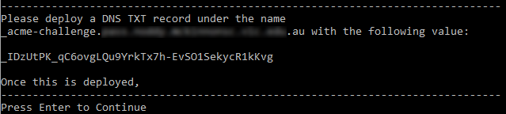
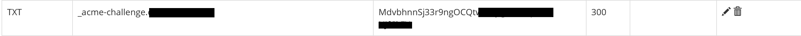
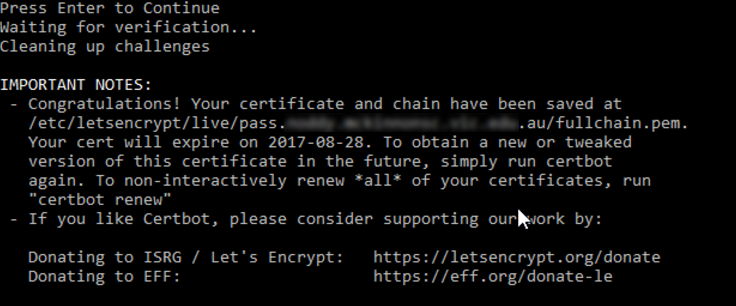

# Docker Examples

## Azure App Service for Linux

In this example, we will deploy the official Docker container for the Ghost blog engine and host a highly available instance with a Azure database for MySQL, Azure Storage for static content and Azure App Service

Here is the high level plan:

* Create a resource group
* Create a Table Storage instance
* Create an Azure MySQL server
* Generate a Lets Encrypt certificate for your custom url
* Create an Azure App Service Plan
* Create an Azure App Service, provision the service from the official Docker image and configure it using environment variables
* Add a custom domain to the Azure App Service & add a certificate to the SSL binding
* Login into Ghost and set the root user account

Let's get started:

## Steps / Instructions 

**Login into Azure & select the subscription**

``` 
az login
az account set -s <subscription guid>
``` 
**Create a resource group**
```
az group create --name <myresourcegroup> --location "Australia Southeast"
```

**Create Storage Account**
```
az storage account create --location "Australia Southeast" --name <storageaccountname> --resource-group <myresourcegroup> --access-tier Hot --default-action Allow --kind StorageV2 --sku Standard_GRS
```
Note the access key

** Create a file share **
```
az storage share create --name contentfiles --account-name <storageaccountname> --account-key <accesskey>
```

**Create Azure MySQL server and database**
```
az mysql server create --admin-password <adminPassword> --admin-user <adminUser> --name <mysqlservername> --resource-group <myresourcegroup> --sku-name B_Gen5_1 --version 5.7 --location "Australia Southeast" --ssl-enforcement Enabled --storage-size 5120
```
```
az mysql db create --resource-group <myresourcegroup> --server-name <mysqlservername> --name <dbname>
```

# **Generate a Lets Encrypt certificate**
<details>
  <summary>Click to expand</summary>


[Install Bash on Ubuntu on Windows ](https://docs.microsoft.com/en-us/windows/wsl/install-win10)

**Run the following commands in your Bash terminal.** 

*Note — you may need to prefix each command with sudo.*

**Add the Certbot repository**
```
add-apt-repository ppa:certbot/certbot
```

**Update package lists to include our new repository**
```
apt-get update
```

**Download & Install Certbot**
```
apt-get install certbot
```

**Generate the certificate**
```
certbot -d <mycustomurl.com> --manual --preferred-challenges dns certonly
```

where

| parameter | description |
| --- | --- |
|   -d |  Your domain
| -manual |  Provides manual instructions for obtaining a certificate |
| -preferred-challenges | Challenge type. In this example, we will be using the DNS challenge, as explained earlier in the article. |

When asked, **“Are you OK with your IP being logged?”**, 
type Y and Enter to continue

**DNS Challenge**



Add the appropriate TXT record to satisfy the DNS challenge

Here is an example



**Validate the record**

Run the following from Command Prompt on your Windows device

```
NSLookup.exe -q=TXT _acme-challenge.<mycustomdomain>.com
```

**Now our record is active, Press Enter**




Certbot will verify your DNS entry and upon success, will provide you with a valid 90-day SSL certificate

**Exporting the certificate (PFX)**

Installing OpenSSL
```
sudo apt-get install openssl
```

Change working directory

```
cd /etc/letsencrypt/live/<mycustomdomain>.com
```

```
openssl pkcs12 -export -out /tmp/<mycustomdomain>-certificate.pfx -inkey privkey.pem -in cert.pem -certfile chain.pem
```

Now we have our PFX certificate at `/tmp/<mycustomdomain>-certificate.pfx`, we can move it somewhere accessible in our Windows device. For example; c:\temp

```
cp /tmp/<mycustomdomain>certificate.pfx /mnt/c/temp
```

</details>

**Create an Azure App Service Plan**

```
az appservice plan create --name <myappserviceplan> --resource-group  <myresourcegroup> --sku S1 --is-linux
```

**Create an Azure App Service, provision the service from the official Docker image and configure it using environment variables**

```
az webapp create --resource-group <myresourcegroup> --plan <myappserviceplan> --name <myappservicename> --deployment-container-image-name ghost:2-alpine
```

**Add an external storage account to the App Service**

```
az webapp config storage-account add -g <myresourcegroup> -n <myappservicename> --custom-id contentvolume --storage-type AzureFiles --account-name <storageaccountname> --share-name contentfiles --access-key <accesskey> --mount-path /var/lib/ghost/content_files
```

**Pass in the ENVIRONMENT variable to the Docker container via App Settings**

```
az webapp config appsettings set --resource-group <myresourcegroup> --name <appservicename> --settings paths__contentPath=/var/lib/ghost/content_files/ url=https://<mycustomdomain>.com NODE_ENV=production privacy_useUpdateCheck=false database__client=mysql database__connection__host=<dbserver> database__connection__port=3306 database__connection__user=<dbuser> database__connection__password=<dbpassword> database__connection__database=<db> database__connection__ssl__rejectunauthorized=true database__connection__ssl=true
```

**Restart the app service**

```
az webapp restart --name <myappservicename> --resource-group <myresourcegroup>
```

**Configure a CNAME record that maps $fqdn to `<mywebappname>.azurewebsites.net`**

```
az webapp config hostname add --webapp-name <mywebappname> --resource-group <myresourcegroup> --hostname <customdomain>

```

**Upload an SSL certificate to the Web App**

```
az webapp config ssl upload --certificate-file {certificate-file} --certificate-password {certificate-password} --name <mywebappname>     --resource-group <myresourcegroup> --query thumbprint --output tsv
```

Note the certificate thumbprint

**Bind the SSL certificate**
```
az webapp config ssl bind --certificate-thumbprint {certificate-thumbprint} --name <mywebappname> --resource-group <myresourcegroup> --ssl-type SNI
```